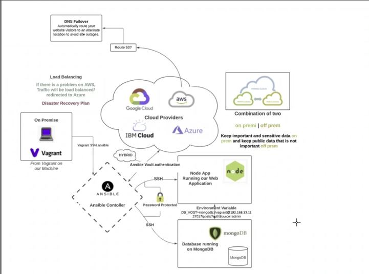

# Infrastructure as Code (IaC)

## What is IaC

IaC is a process of managing and provisioning of computer infrastructure through the code, instead of manually. 

With IaC you can crete configuration files with infrastructure specification, so it's easier to edit and distribute it. Also, by using Configuration files, you ensure that every time  you provision the same environment. 

IaC uses version control as well, so any changes you do to the configuration files should be under different versions to ensure you can return back to the previous version if needed.

Automating infrastructure provisioning with IaC means that developers don't need to manually provision the servers each time they develop and deploy the app.


### Benefits of IaC

* Cost reduction
* Increase in speed of deployments
* Reduce errors
* Improve infrastructure consistency
* Eliminate configuration drift

### Use cases of IaC

* In software development life cycle. When the environments are uniform the chance of the bugs is much lower, as well as it reduces the time required for deployment and configuration of all the environments. 
* IaC 
* Some of the large known companies that are using IaC are Netflix and Google. They use IaC in order to help them to manage their large scale infrastructure efficiently. 


### Configuration management

Configuration management is the process of configuring provisioned infrastructure resources. For example, configuring a server with required application.

The primary goal is to configure a server. You can use tools like Ansible in order to install and configure an application automatically (e.g., Nginx).


### What is Ansible



Ansible is an open source automation tool that automates provisioning, configuration management, application deployment and many more other processes. Ansible can be used to automate software installation, daily tasks, provisioning, system patching etc.

### Ansible playbook
A playbook is a file written in YAML that provides instructions for what needs to be done in order to bring a managed node into the desired state.

### Ansible benefits
* Simple to learn
* Easily understandable Python language
* No dependency on Agents
* Playbook is written in YAML


## Creating Ansible controller and Web/Db nodes

1. Create a project in VS Code
2. Use bash terminal to run the `vagrant init` command to initialise the project folder, which will create a Vagrant file
3. Inside the Vagrant file replace the config code with the following code:
```
# -*- mode: ruby -*-
 # vi: set ft=ruby :
 
 # All Vagrant configuration is done below. The "2" in Vagrant.configure
 # configures the configuration version (we support older styles for
 # backwards compatibility). Please don't change it unless you know what
 
 # MULTI SERVER/VMs environment 
 #
 Vagrant.configure("2") do |config|
  # creating are Ansible controller
    config.vm.define "controller" do |controller|
      
     controller.vm.box = "bento/ubuntu-18.04"
     
     controller.vm.hostname = 'controller'
     
     controller.vm.network :private_network, ip: "192.168.33.12"
     
     # config.hostsupdater.aliases = ["development.controller"] 
     
    end 
  # creating first VM called web  
    config.vm.define "web" do |web|
      
      web.vm.box = "bento/ubuntu-18.04"
     # downloading ubuntu 18.04 image
  
      web.vm.hostname = 'web'
      # assigning host name to the VM
      
      web.vm.network :private_network, ip: "192.168.33.10"
      #   assigning private IP
      
      #config.hostsupdater.aliases = ["development.web"]
      # creating a link called development.web so we can access web page with this link instread of an IP   
          
    end
    
  # creating second VM called db
    config.vm.define "db" do |db|
      
      db.vm.box = "bento/ubuntu-18.04"
      
      db.vm.hostname = 'db'
      
      db.vm.network :private_network, ip: "192.168.33.11"
      
      #config.hostsupdater.aliases = ["development.db"]     
    end
  
  
  end
```

This code will create 3 separate VMs: controller, web, and db

4. Use `vagrant up` to start the VMs. Ensure that you run VirtualBox as Administrator

5. Open GitBash terminal as Administrator and `cd` into the folder where you Vagrantfile is
6. You can use `vagrant status` in order to check what VMs are running
7. Use `vagrant ssh <VM_name>` in order to connect to the VM. For example `vagrant ssh controller`
8. Once you connected run `sudo apt update -y` and `sudo apt upgrade -y`
9. Repeat previous two steps for each VM. You can open a new GitBash terminal to make it easier
10. Once all the machines are updated, go back to your `controller` VM
11. Use `python --version` to check what version of Python is installed. You need at least 2.7.x up to 3.6.x
12. Run `sudo apt install software-properties-common`
13. Run `sudo apt-add-repository ppa:ansible/ansible`
14. Run `sudo apt update -y`
15. Run `sudo apt instal ansible -y`
16. Use `ansible --version` to ensure Ansible is installed and it is correct version
17. You can use `ssh vagrant@<VM_IP>` to connect to the specific VM through your controller. It will ask you to add the password for your connection. *!When typing the password it wont be visible in the CLI for security reason!*

## Use controller and agent nodes with Ansible
1. Use `Vagrant up` to start VMs and then connect to `controller` VM vis GitBash terminal using `vagrant ssh controller`
2. `cd /etc/ansible/` - navigate to default Ansible directory
3. `ls` - check in `ansible.cnf` and `hosts` exists
4. `sudo apt install tree` - install tree package
5. `tree` - use the command to see the list of files instead of `ls`
6. `sudo ansible all -m ping` - check connections with agent nodes:
  * `-m` - module
  * `all` - looks for all agent nodes
  * `ping` - ping the agent nodes to check connection

7. `ssh vagrant@192.168.33.10` - connect to `web` VM
8. Upgrade and update `web` VM
```
sudo apt update -y`
sudo apt upgrade -y
```
9. `exit` - return back to controller
10. `ssh vagrant@192.168.33.11` - connect to `db` VM
11. Update and upgrade the `db` VM
```
sudo apt update -y
sudo apt upgrade -y
```
12. `exit` - return back to controller
13. `pwd` - use to ensure you are still in `etc/ansible/` directory

14. `sudo nano hosts` - open hosts file

15. Add the following lines of code: 
```
[web]
192.168.33.10
```
16. `sudo ansible web -m ping` - will give an error about public key
17. `sudo nano hosts` - to go back to hosts file
18. `192.168.33.10 ansible_connection=ssh ansible_ssh_user=vagrant ansible_ssh_pass=vagrant` - we verify the connection: type ssh, user vagrant, and password vagrant"
19. `sudo ansible web -m ping` - now this time connection should work

20. `sudo nano hosts`
21. Add following lines to connect to `db` VM
```
[db]
192.168.33.11 ansible_connection=ssh ansible_ssh_user=vagrant ansible_ssh_pass=vagrant`
```
  If connection is not verified do the following steps:
  * `sudo nano ansible.cfg`
  * add `host_key_checking = false` under `[defaults]`
22. `sudo ansible all -m ping` - now both VMs should be connected and responding

### Ansible ad hoc commands

* `sudo ansible all -a "date"` - date and timezone for each machine
* `sudo ansible all -a "uname -a"` - information about each machine
* `sudo ansible all -a "free"` - shows free memory on each machine


* `sudo nano test.txt` - create test txt file
* add `# testing data transfer from controller to web-vm using adhoc command`
* use`sudo ansible web -m copy -a "src=/etc/ansible/test.txt dest=/home/vagrant"` to copy file over to `web` VM:
  * `web` - agent node where we want to copy to
  * `-m copy` - module copy, that will create a copy of the file
  * `-a "src=/etc/ansible/test.txt dest=/home/vagrant"` - attribute that specifies a source, where file located on the controller, and the destination folder, where file will be copied on the `web` machine


  ## Creating YAML playbook

  1. `sudo nano install-nginx-playbook.yaml` - create new YAML playbook

  2. Add following script:

  ```

  # creating a playbook to install nginx web server

  # YAML file starts with ---
  ---
  # where would you like to install nginx
  - hosts: web

  # would you like to see logs (optional)
    gather_facts: yes

  # do we need admin access "sudo"
    become: true

  # add the instructions - commands
  tasks:
    - name: Install nginx in web-server

      apt: pkg=nginx state=present

  # ensure status is active

  ```

3. `sudo ansible-playbook install-nginx-playbook.yml` - run yaml playbook

4. `sudo ansible web -a "systemctl status nginx"` - check status of nginx on the `web` VM


## Create a Playbook to install nodejs and npm for a SpartaApp

1. Create a new playbook file using `sudo nano install-nodejs-playbook.yml`

2. Add the following YAML code to the playbook:
```
# creating a playbook to install nodejs


---
# destination where to install nodejs

- hosts: web

# display the logs?
  gather_facts: yes

# allow admin access?
  become: true

# add the instructions - commands
  tasks:
  - name: Install Nodejs
    apt:
      name: nodejs
      state: present
  - name: Install npm
    apt:
      name: npm
      state: present

  - name: Install python
    apt:
      name: python
      state: present

# ensure the status of nodejs

```

3. Use the following code to copy the app to your agen node `scp -r <source_location> <destination_location>, where:
    * <source location> is `/c/Users/olegf/app`
    * <destination_location> is `vagrant@192.168.33.10:/home/vagrant`

4. Now you can launch the app:
    4.1 `ssh vagrant@192.168.33.10` to connect to web machine
    4.2 `cd app` to navigate to app folder
    4.3 `node app.js &` to run the app in the background

5. Use `192.168.33.10:3000` to verify that app is working in the browser


## Create a Playbook file to install Mongodb on the database server

1. `sudo nano mongo-db-playbook.yml` - create a new playbook for Mongodb
2. Type in the following YAML script:

```
# this playbook will install mongodb on the database server
---
# location where it will be installed
- hosts: web
# display the logs
  gather_facts: yes
# give admin permission
  become: true

# adding commands to install mongo db and status running
  tasks:
  - name: configuring Mongo-db in db agent
    apt: pkg=mongodb state=present

# check status with Adhoc command

```

3. Run the playbook `sudo ansible-playbook mongo-db-playbook.yml`
4. Check the status of mongodb `sudo ansible db -a "systemctl status mongodb`


## Connect the app to database and seed the data

1. Use `ssh vagrant@192.168.33.11` to connect to db machine
2. Use `sudo nano /etc/mongod.conf` to edit mongod configuration file
3. Change bind_ip to `0.0.0.0`
4. Restart mongodb using `sudo systemctl restart mongodb`
5. Enable `sudo systemctl enable mongodb`
6. Check the status if it's active `sudo systemctl status mongodb`
7. Connect to your `web` machine
8. Use `export DB_HOST=mongodb://192.168.33.10:27017/posts` to create environment variable
9. Use `prinenv DB_HOST` to check if variable exists
10. `cd app`
11. Use `npm install`
12. Use `node app.js &`
13. Type `192.168.33.10:3000/posts` in order to check if posts page is working


## Create a playbook to configure mongodb.conf file

1. In controller machine create a new playbook `sudo nano mongo-cong.yml`
2. Add the following code:
```
# playbook to configure mongodb on the db machine
---

- hosts: db

  gather_facts: yes

  become: true

# commands to configure mongodb.conf
  tasks:
  - name: change bing_ip in mongodb.conf
    lineinfile:
      path: /etc/mongodb.conf
      regexp: 'bind_ip = 0.0.0.10'
      line: 'bind_ip = 0.0.0.0'
      backrefs: yes

  - name: restart mongodb
    shell: systemctl restart mongodb

  - name: enable mongodb
    shell: systemctl enable mongodb

# use ad hoc commands to check if mondodb is active
```

3. Use `sudo ansible-playbook mongo-cong.yml` to run the playbook
4. Use `sudo ansible web -a "systemctl status monodb` to check if mondogb running


## Create a playbook to add env variable DB_HOST to web machine

1. In controller machine create a new playbook `sudo nano app-env.yml`
2. Add the following code:
```
# playbook to create an env variable for DB_HOST

---

- hosts: db

  gather_facts: yes

  become: true

# commands to create env variable

  tasks:
  - name: create DB_HOST
    shell: export DB_HOST=mongodb://192.168.33.11:27017/posts

# use Adhoc command to check if DB_HOST exists
```
3. Use `sudo ansible-playbook mongo-cong.yml` to run the playbook
4. Coonect to web machine using `ssh vagrant@192.168.33.10`
5. You can use `printenv DB_HOST` to check if variable was created
6. `cd app`
7. Use `npm install`
8. Use `node app.js &`
9. Type `192.168.33.10:3000/posts` in your browser to check if the app is launched and posts page is working